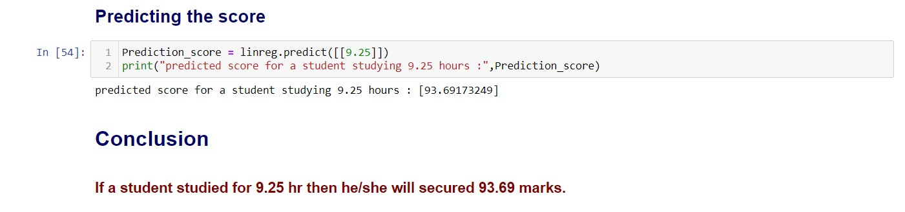

# Task 1 : Prediction Using Supervised ML

In this regression task we predicted of marks that a student is expected to score based upon the number of hours they studied. This is a simple linear regression task as it involves just two variables. Data can be found at  http://bit.ly/w-data

    

